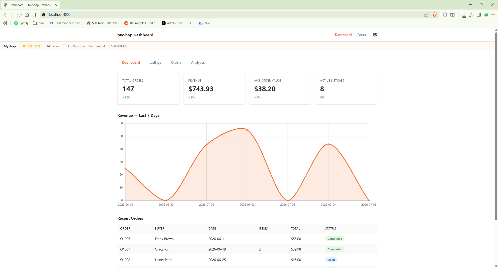
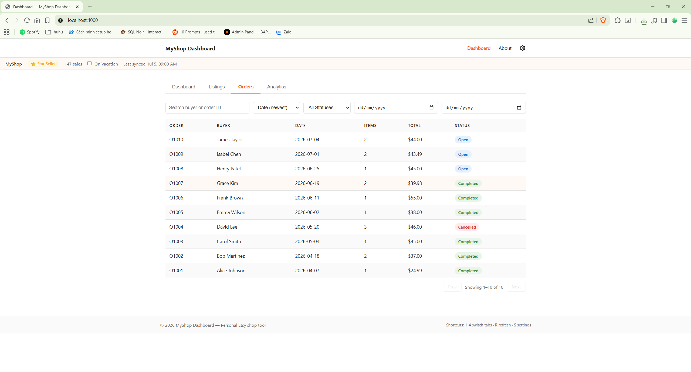
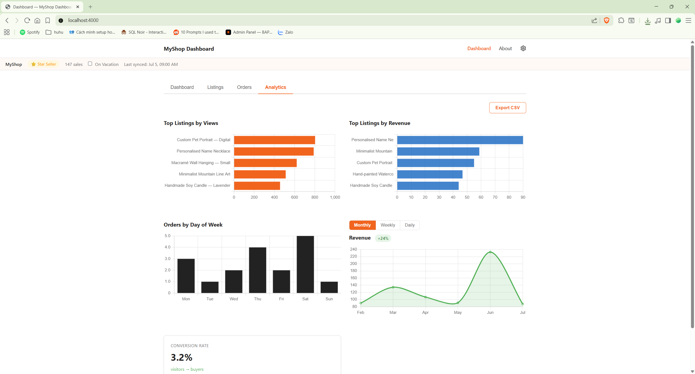

# MyShop Dashboard

A personal, single-owner dashboard for order tracking & fulfillment,
revenue analytics, and review management for an Etsy shop. Built as a
self-hosted tool for the shop owner, not a multi-tenant SaaS.

## What it's for

Running an Etsy shop means checking sales, order status, and reviews
across scattered pages. This app pulls that into one screen with five
views:

- **Dashboard** — key stats (orders, revenue, average order value,
  active listings) and a 7-day revenue chart at a glance
- **Orders tracking & fulfillment** — filter by status and date,
  search by buyer or order ID, sort by date/total, drill into an
  order's shipping address and notes, and mark orders fulfilled
- **Analytics & revenue insights** — top listings by views and by
  revenue, orders by day of week, revenue by day/week/month with
  period toggle and percent-change badge, and CSV export
- **Review management** — view buyer reviews and ratings, respond to
  reviews, and flag ones that need follow-up
- **Listings** — a read-only view of existing listings (price,
  quantity, view counts); this app does not create, edit, or manage
  listings — Etsy's Personal Access API tier does not grant listing
  management scopes, only read access to shop/order/review data

Keyboard shortcuts (`1`–`4` to switch tabs, `R` to refresh, `S` for
settings) make it fast to use day-to-day.

## Screenshots

**Dashboard** — stats at a glance and 7-day revenue trend



**Orders** — search, filter, sort, and paginate orders



**Analytics** — top listings, revenue trends, and CSV export



## Status

Currently runs entirely on mock data (`src/data/mockData.js`) — no
Etsy API key required to try it out. It's built to later plug in a real
Etsy OAuth2 connection and live shop data without changing the UI.

## What this is (and isn't)

This is a **personal tool built by a single Etsy shop owner for their own
shop**. It is not a third-party service, not a SaaS product, and not
distributed to other sellers. It runs on the owner's own machine/server,
and no shop, order, or customer data is collected, stored remotely, or
shared with anyone else — everything stays local to the instance you run.
It was built primarily as a learning project (Node/Express, OAuth2,
Docker) and as a convenience dashboard for the author's own shop.

The term "Etsy" is a trademark of Etsy, Inc. This application uses the
Etsy API but is not endorsed or certified by Etsy, Inc. This disclaimer
is shown prominently in the app itself, at the top of the
[About page](src/views/about.ejs) and in the footer of every page.

## Etsy API usage

- All access to Etsy shop data (once connected) goes through Etsy's
  official OAuth2 flow (`/auth/etsy`, `/auth/callback` in
  [src/routes/auth.js](src/routes/auth.js)) — there is no
  screen-scraping of etsy.com anywhere in this codebase, and no bypass
  of OAuth for private/member data.
- The app never calls `api.etsy.com` on its own initiative outside of a
  direct, user-triggered action — no polling loops, background jobs, or
  health checks are pointed at Etsy's real API. Automated tests
  (`scripts/smoke-test.js`, `loop.config` TEST_CMD) run entirely against
  the local server and mock data; they never reach out to etsy.com.
- The app's own color theme uses a distinct brand color (teal), not
  Etsy's orange, so the app's identity is never confused with Etsy's
  branding.

## Testing checklist (when testing against a real Etsy shop)

Etsy's [API Testing Policy](https://www.etsy.com/legal/policy/api-testing-policy/)
requires the following whenever this app is tested against a real,
non-mock Etsy shop. Follow this checklist every time:

- [ ] Enable **Developer Mode** on the shop before testing
- [ ] Any listing created for testing is left in **draft** status
- [ ] Any test listing is priced **under $1**
- [ ] **Deactivate** test listings immediately after testing is done
- [ ] If a dedicated test shop is used, its name **contains "test"**

## Tech stack

- Node.js 20 + Express 4
- EJS server-side templates, no client-side framework
- Chart.js 4 and Lucide icons via CDN
- Vanilla CSS, no framework
- No database — settings persisted in browser localStorage

## Running it

### Docker (recommended)

```bash
docker compose up -d --build
```

The app listens inside the container on port 3000; `docker-compose.yml`
maps it to `${APP_PORT:-4000}` on the host, so open
http://localhost:4000.

### Locally

```bash
npm install
cp .env.example .env
npm start
```

Open http://localhost:3000 (or whatever `PORT` is set to in `.env`).

## Project layout

```
src/
  app.js            Express entry point
  data/mockData.js  Mock shop data
  routes/           index, auth, api, settings
  views/            EJS templates (layout, app, about, settings)
public/
  css/style.css     All styling
  js/               Tab switching, charts, settings
state/              Design/requirements docs for this project's build process
```
